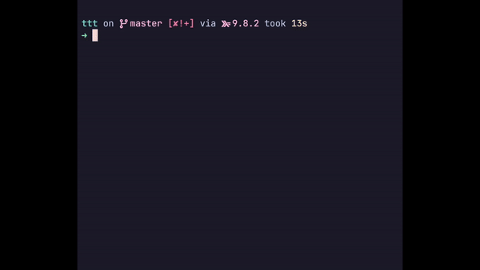

# Tic Tac Toe



My first Haskell project

Uses

- `ghcup` with `ghc` v9.8.2 and `cabal` v3.1.0.3.0
- [Brick](https://github.com/jtdaugherty/brick) TUI library

Dev commands

```
cabal build
cabal run
```
